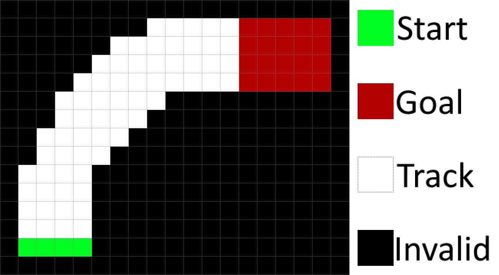
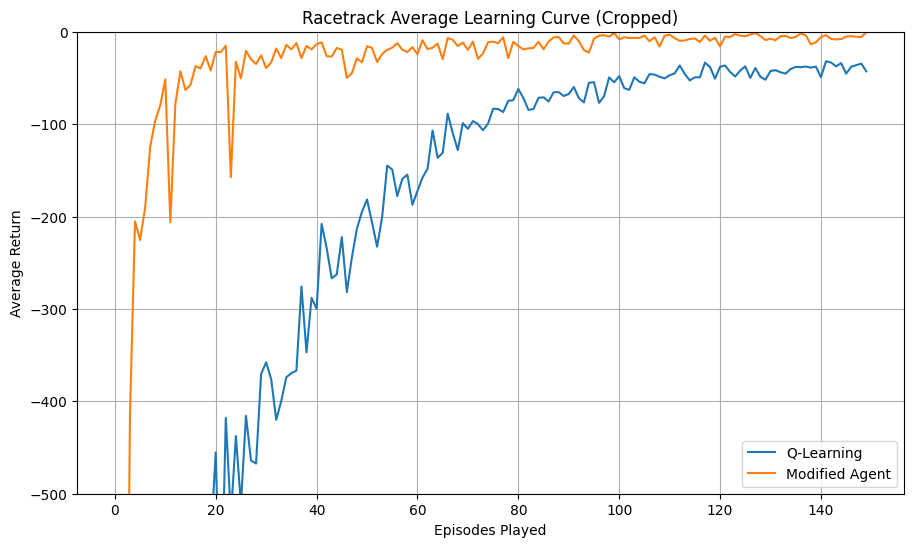

# RaceTrackDynaQ
Reinforcement Learning for a race car

I have implemented the DynaQ algorithm which combines model-based planning with real experience. I have also used learning decay, which means that after extensive information is collected on the environment any further learning would be of stochastic “noise” events. Finally, epsilon decay is also used based on performance. This is because as our returns stagnate we approach the optima and discourage exploration, giving better final performance.

The graph above shows that the modifications resulted in quicker learning and better final performance. The quickened performance can be attributed to the “planning”, bootstrapping information for the model allowing it to learn quicker. The long-term performance improvements was from the epsilon decay discouraging exploration as we approach optimum and learner decay reducing overfitting to noise. 

# References

Racetrack environment code by Dr Joshua Evans

Plotting code by Dr Joshua Evans
