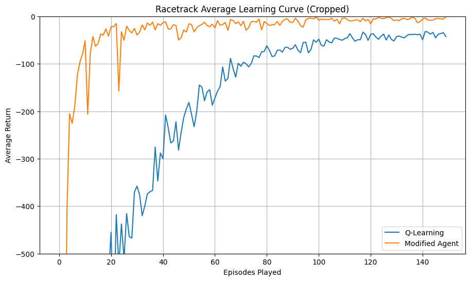

# RaceTrackDynaQ
Reinforcement Learning for a race car

I have implemented the DynaQ algorithm which combines model-based planning with real experience. I have also used learning decay, which means that after extensive information is collected on the environment any further learning would be of stochastic “noise” events. Finally, epsilon decay is also used based on performance. This is because as our returns stagnate we approach the optima and discourage exploration, giving better final performance.

